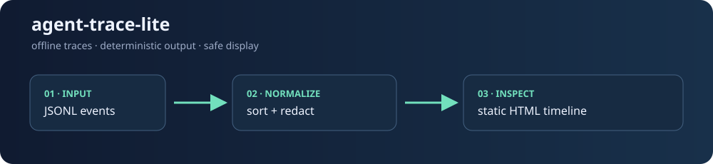

# agent-trace-lite



Offline, provider-neutral JSONL trace normalization and a static HTML timeline for model, tool, subprocess, transfer, guardrail, and error events. It has no runtime dependencies, does not contact a provider, and redacts sensitive fields before output.

## Install

Requires Python 3.11 or newer.

```sh
python -m pip install agent-trace-lite
```

Or install the local checkout:

```sh
python -m pip install .
```

## Quick start

```sh
agent-trace normalize trace.jsonl -o normalized.jsonl --hash
agent-trace view trace.jsonl -o trace.html
agent-trace demo -o demo.html
```

Open `trace.html` in any browser. The viewer is a single self-contained file and works offline. Use `-` as the input path to read JSONL from stdin:

```sh
cat trace.jsonl | agent-trace view - -o trace.html
```

Each input line is a JSON object. `type` (also `event` or `kind`) is normalized to one of `model`, `tool`, `subprocess`, `transfer`, `guardrail`, or `error`; common aliases such as `llm`, `command`, and `policy` are accepted. Timestamps may be ISO-8601 or Unix seconds. Same-time events retain source order.

### Example

```json
{"timestamp":"2026-01-02T03:04:05Z","type":"model","model":"demo","prompt":"hello","api_key":"never print me"}
{"timestamp":"2026-01-02T03:04:06Z","type":"tool","name":"search","arguments":{"q":"offline"}}
```

The `data` object is preserved with stable key ordering. Keys matching secret, token, password, credential, cookie, authorization, and private-key patterns are replaced with `[REDACTED]`; common bearer and API-token values in strings are redacted too.

## Development

```sh
python -m pip install -e '.[test]'
python -m pytest
python -m build
```

Run the checked-in fixture demo without network access:

```sh
agent-trace view examples/demo.jsonl -o trace-demo.html
```

Or render the same synthetic event families without a fixture file:

```sh
agent-trace demo -o trace-demo.html
```

When developing from a source checkout before installing the package, use:

```sh
python -m agent_trace_lite.cli view examples/demo.jsonl -o /tmp/agent-trace-demo.html
```

See [CONTRIBUTING.md](CONTRIBUTING.md), [SECURITY.md](SECURITY.md), and [docs/releasing.md](docs/releasing.md).

## License

MIT. See [LICENSE](LICENSE).
