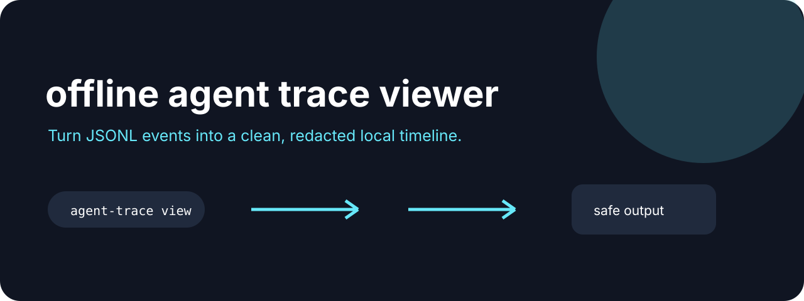

# Agent Trace Lite



**Turn JSONL events into a clean, redacted local timeline with integrity readback.**

[](https://github.com/jonah-ux/agent-trace-lite/actions/workflows/ci.yml)
[](https://www.python.org/)
[](LICENSE)

Agent Trace Lite turns line-oriented event logs into a small HTML timeline. Sensitive-looking
keys such as `token`, `secret`, and `password` are redacted in the rendered view, while the
original JSONL remains under your control on disk.

## Try it in 30 seconds

```bash
git clone --depth 1 https://github.com/jonah-ux/agent-trace-lite.git
cd agent-trace-lite
python -m pip install .
python demos/demo.py
```

Point it at any JSONL event stream:

```bash
cat > events.jsonl <<'JSONL'
{"type":"tool","name":"read_file","token":"demo-secret"}
{"type":"result","message":"done"}
JSONL
agent-trace view events.jsonl --html trace.html
open trace.html
```

Inspect a trace without rendering it, or query a safe subset for an incident report:

```bash
agent-trace inspect events.jsonl
agent-trace query events.jsonl --type tool --contains timeout --limit 20
```

`inspect` emits `agent-trace/inspect/v1` with deterministic raw and redacted SHA-256
digests, line and event counts, type counts, and the number of redactions. `query` emits
`agent-trace/query/v1` and recursively redacts nested sensitive keys before matching or
printing. Malformed JSON and non-object lines fail closed with a line number instead of
silently disappearing.

## See it work

The demo turns two local events into a redacted HTML artifact and reports exactly what it wrote (the temporary path varies per run):

```json
{"schema":"agent-trace/v1","events":2,"html":"<temporary>/trace.html"}
```

Open the [redaction and event inspector walkthrough](docs/walkthrough.html) for a visual tour of
the timeline, digest readback, and safe query path. The browser board uses illustrative events;
it does not invoke the CLI or read your files.

## Related tools

Use [Chatlens](https://github.com/jonah-ux/chatlens) to find the session, [Agent Proof](https://github.com/jonah-ux/agent-proof) to record the investigation, and [Context Pack](https://github.com/jonah-ux/context-pack) to bound the repository context alongside the trace.

The command keeps the `agent-trace/v1` view summary contract and adds the raw content digest.
It is a small local viewer for debugging agent runs, not a hosted telemetry system. The raw
digest is never the raw event content, and query/view output only contains the recursively
redacted representation.

## Development

```bash
python -m unittest discover -s tests
python -m build --sdist --wheel
```

MIT licensed.
